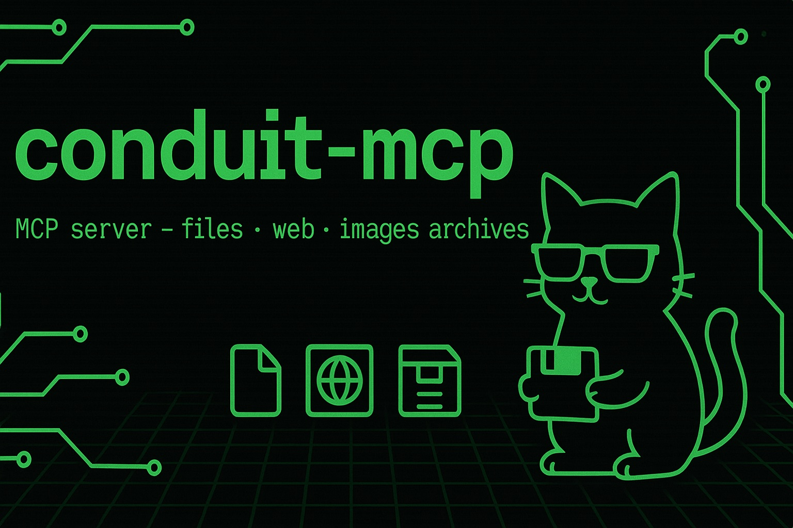

# conduit-mcp 🐱



**The purr-fect MCP server for feline-fast file operations, web prowling, and data hunting! 🐾**

_A sleek Model Context Protocol server that helps your AI assistant navigate the digital jungle with cat-like agility._

## 🎉 Version 1.0.0 Released!

We're excited to announce the first stable release of conduit-mcp! This production-ready MCP server brings powerful file system operations, web content processing, and advanced search capabilities to your AI assistant.

## 🐈 What Makes This Cat Special?

`conduit-mcp` is like having a highly trained data-hunting cat that can:

- 🏠 **Patrol your file system** (within allowed territories, of course!)
- 🌐 **Hunt across the web** for tasty content morsels
- 📄 **Clean up messy HTML** into pristine Markdown
- 🖼️ **Compress images** without losing their shine
- 📁 **Organize files** with military precision
- 🔍 **Track down specific files** using advanced search techniques
- 📦 **Pack and unpack archives** like a pro moving service
- ⚡ **Process operations in batches** for maximum efficiency

Unlike those lazy house cats, this server works 24/7 and never knocks things off your desk! 😸

## 🎯 Quick Start (Get Your Cat Running!)

### Method 1: The Easy Way (Recommended)

Just tell your MCP client about your new digital pet:

```json
{
  "mcpServers": {
    "conduit_mcp": {
      "command": "npx",
      "args": ["-y", "@steipete/conduit-mcp@beta"],
      "env": {
        "CONDUIT_ALLOWED_PATHS": "~/Documents:~/Projects",
        "LOG_LEVEL": "INFO"
      }
    }
  }
}
```

### Method 2: The Developer Way (For Cat Breeders)

```bash
git clone <repository_url>
cd conduit-mcp
npm install
# Configure your MCP client to use ./start.sh
```

## 🏠 Setting Up Your Cat's Territory

Your digital cat needs to know where it's allowed to roam! Configure the `CONDUIT_ALLOWED_PATHS` environment variable:

```bash
# Let your cat explore Documents and Projects
CONDUIT_ALLOWED_PATHS="~/Documents:~/Projects"

# Default playground (if you don't specify)
# Your cat defaults to: "~:/tmp"
# (Don't worry, it'll meow about this the first time!)
```

**🚨 Security Notice:** Your cat is well-trained and won't venture outside its allowed territories. It also follows all symlinks to ensure no sneaky escapes!

## 🐾 What Your Cat Can Do

### 🔍 The `read` Tool - Master Detective Cat

Your cat can investigate files and URLs with three different specialties:

#### Content Reading (`operation: "content"`)

Read and process content from files or URLs in various formats.

```json
{
  "tool": "read",
  "operation": "content",
  "sources": ["~/Documents/important.txt", "https://example.com/article"],
  "format": "text"
}
```

**Format Options:**

- `"text"` - Read as plain text (default for text files)
- `"base64"` - Binary-safe encoding (default for images/binaries)
- `"markdown"` - Web pages get the full spa treatment! 🧖‍♀️
- `"checksum"` - Generate cryptographic fingerprints

**Parameters:**

- `sources`: `string[]` (Required) - Array of file paths or URLs
- `format?`: `string` (Optional) - Output format
- `checksum_algorithm?`: `string` (Optional) - `"md5" | "sha1" | "sha256" | "sha512"`
- `offset?`: `integer` (Optional) - Byte offset to start reading from
- `length?`: `integer` (Optional) - Number of bytes to read

**Special Powers:**

- 🌐 **Web Page Cleaning**: Turns messy HTML into beautiful Markdown using Mozilla Readability
- 🖼️ **Smart Image Compression**: Automatically compresses large images with Sharp
- 📐 **Partial Reading**: Read specific byte ranges with `offset` and `length`
- 🔒 **Checksum Calculation**: SHA256, MD5, SHA1, or SHA512

#### Metadata Inspection (`operation: "metadata"`)

Get detailed information about files or URLs without reading their content.

```json
{
  "tool": "read",
  "operation": "metadata",
  "sources": ["~/Documents/mystery_file.pdf"]
}
```

**Returns:** File size, MIME type, timestamps, permissions, HTTP headers (for URLs), and more!

#### File Comparison (`operation: "diff"`)

Compare two files and see exactly what changed.

```json
{
  "tool": "read",
  "operation": "diff",
  "sources": ["~/file1.txt", "~/file2.txt"],
  "diff_format": "unified"
}
```

**Parameters:**

- `sources`: `string[2]` (Required) - Exactly two file paths
- `diff_format?`: `string` (Optional) - Currently supports `"unified"`

### ✏️ The `write` Tool - Master Builder Cat

Your cat can modify the file system with surgical precision through various actions:

#### File Operations (`action: "put"`)

Write content to files with different encoding and write modes.

```json
{
  "tool": "write",
  "action": "put",
  "entries": [
    {
      "path": "~/Documents/new_file.txt",
      "content": "Hello from your digital cat! 🐱",
      "write_mode": "overwrite",
      "input_encoding": "text"
    }
  ]
}
```

**Parameters for `put`:**

- `path`: `string` (Required) - Target file path
- `content`: `string` (Required) - Content to write
- `input_encoding?`: `"text" | "base64"` (Optional, default: `"text"`)
- `write_mode?`: `"overwrite" | "append" | "error_if_exists"` (Optional, default: `"overwrite"`)

#### Directory Operations (`action: "mkdir"`)

Create directories with optional recursive creation.

```json
{
  "tool": "write",
  "action": "mkdir",
  "entries": [
    {
      "path": "~/Documents/new_folder/subfolder",
      "recursive": true
    }
  ]
}
```

#### File Management (`action: "copy" | "move" | "delete"`)

Copy, move, or delete files and directories.

```json
{
  "tool": "write",
  "action": "copy",
  "entries": [
    {
      "source_path": "~/file.txt",
      "destination_path": "~/backup/"
    }
  ]
}
```

**Available Actions:**

- `"put"` - Write files (text or base64)
- `"mkdir"` - Create directories (with `recursive` option)
- `"copy"` - Duplicate files/folders
- `"move"` - Relocate and rename
- `"delete"` - Remove files/folders (with `recursive` for directories)
- `"touch"` - Update timestamps or create empty files

#### Archive Operations

Create and extract archives in multiple formats.

**Create Archive (`action: "archive"`):**

```json
{
  "tool": "write",
  "action": "archive",
  "source_paths": ["~/Documents/folder1", "~/Documents/file1.txt"],
  "archive_path": "~/backup.zip",
  "format": "zip",
  "recursive_source_listing": true
}
```

**Extract Archive (`action: "unarchive"`):**

```json
{
  "tool": "write",
  "action": "unarchive",
  "archive_path": "~/backup.zip",
  "destination_path": "~/restored/",
  "format": "zip"
}
```

**Archive Formats:** ZIP, TAR.GZ, TGZ - your cat handles them all!

### 📋 The `list` Tool - Inventory Cat

#### Directory Listing (`operation: "entries"`)

Explore directory structures with recursive capabilities.

```json
{
  "tool": "list",
  "operation": "entries",
  "path": "~/Documents",
  "recursive_depth": 2,
  "calculate_recursive_size": true
}
```

**Parameters:**

- `path`: `string` (Required) - Directory to list
- `recursive_depth?`: `integer` (Optional, default: `0`) - How deep to recurse
- `calculate_recursive_size?`: `boolean` (Optional, default: `false`) - Calculate total size of directories

**Special Features:**

- 🌳 **Recursive Exploration**: Dive deep into folder structures
- 📊 **Size Calculation**: Get total size of directories and their contents
- 🔗 **Symlink Detection**: Identifies and follows symbolic links
- ⏱️ **Smart Timeouts**: Won't get stuck calculating huge directories

#### System Information (`operation: "system_info"`)

Get information about the server and file system.

```json
{
  "tool": "list",
  "operation": "system_info",
  "info_type": "server_capabilities"
}
```

**Info Types:**

- `"server_capabilities"` - Server version, configuration, supported features
- `"filesystem_stats"` - File system statistics for a given path

### 🔎 The `find` Tool - Bloodhound Cat

The most sophisticated search tool - your cat can find ANYTHING using multiple criteria:

```json
{
  "tool": "find",
  "base_path": "~/Documents",
  "recursive": true,
  "match_criteria": [
    {
      "type": "name_pattern",
      "pattern": "*.{pdf,doc,docx}"
    },
    {
      "type": "metadata_filter",
      "attribute": "size_bytes",
      "operator": "gt",
      "value": 1048576
    }
  ],
  "entry_type_filter": "file"
}
```

**Parameters:**

- `base_path`: `string` (Required) - Starting directory
- `recursive?`: `boolean` (Optional, default: `true`) - Search subdirectories
- `match_criteria`: `object[]` (Required) - Array of search criteria (ALL must match)
- `entry_type_filter?`: `"file" | "directory" | "any"` (Optional) - Filter by entry type

#### Search Criteria Types

**Name Pattern Matching:**

```json
{
  "type": "name_pattern",
  "pattern": "*.txt"
}
```

**Content Search:**

```json
{
  "type": "content_pattern",
  "pattern": "TODO|FIXME",
  "is_regex": true,
  "case_sensitive": false,
  "file_types_to_search": [".js", ".ts", ".py"]
}
```

**Metadata Filtering:**

```json
{
  "type": "metadata_filter",
  "attribute": "modified_at_iso",
  "operator": "after",
  "value": "2023-01-01T00:00:00Z",
  "case_sensitive": false
}
```

**Search Superpowers:**

- 🎯 **Multi-criteria AND logic**: All criteria must match
- 🔤 **Glob patterns**: `*.txt`, `image[0-9]?.png`, `**/logs/*.log`
- 📝 **Content search**: Text or regex patterns in file contents
- 📅 **Date filtering**: Find files by creation/modification dates
- 📏 **Size filtering**: Find large files, empty files, etc.
- 🎭 **MIME type filtering**: Search by file type

### 🧪 The `test` Tool - Quality Assurance Cat

A debugging tool for testing the MCP server functionality.

```json
{
  "tool": "test",
  "operation": "echo",
  "params_to_echo": { "message": "Hello, world!" }
}
```

**Operations:**

- `"echo"` - Echo back provided parameters for testing
- `"generate_error"` - Generate specific error codes for testing error handling

## 🎛️ Configuring Your Cat

Your digital cat responds to these environment variables:

### Core Settings

```bash
# Territory boundaries (IMPORTANT!)
CONDUIT_ALLOWED_PATHS="~/Documents:~/Projects:/tmp"

# Logging (where your cat writes its diary)
LOG_LEVEL="INFO"  # TRACE, DEBUG, INFO, WARN, ERROR, FATAL
CONDUIT_LOG_FILE_PATH="/tmp/conduit-mcp.log"  # or "NONE" to disable
```

### Performance Tuning

```bash
# Resource limits (keep your cat well-behaved)
CONDUIT_MAX_PAYLOAD_SIZE_BYTES="10485760"      # 10MB max incoming requests
CONDUIT_MAX_FILE_READ_BYTES="52428800"         # 50MB max file reads
CONDUIT_MAX_FILE_READ_BYTES_FIND="524288"      # 512KB max for find content search
CONDUIT_MAX_URL_DOWNLOAD_SIZE_BYTES="20971520" # 20MB max downloads
CONDUIT_HTTP_TIMEOUT_MS="30000"                # 30 second timeouts

# Image compression (make photos diet-friendly)
CONDUIT_IMAGE_COMPRESSION_THRESHOLD_BYTES="1048576"  # 1MB threshold
CONDUIT_IMAGE_COMPRESSION_QUALITY="75"               # Quality 1-100
```

### Advanced Settings

```bash
# Search and recursion limits
CONDUIT_MAX_RECURSIVE_DEPTH="10"           # How deep to explore
CONDUIT_RECURSIVE_SIZE_TIMEOUT_MS="60000"  # 60 second timeout

# Default checksum algorithm
CONDUIT_DEFAULT_CHECKSUM_ALGORITHM="sha256"  # md5, sha1, sha256, sha512
```

## 🎉 Special Features That Make This Cat Purr

### 🌐 Web Content Cleaning

When you ask for Markdown from a URL, your cat:

1. Fetches the raw HTML
2. Uses Mozilla Readability to extract main content
3. Converts to clean Markdown with Turndown
4. Serves you a beautifully formatted result!

For non-HTML content, it gracefully falls back to raw text with helpful notes.

### 🖼️ Intelligent Image Compression

Large images automatically get compressed using Sharp:

- JPEG/WebP: Quality-based compression
- PNG: Lossless optimization
- Preserves original size information
- Graceful fallback if compression fails

### 🔒 Security Features

Your cat is security-conscious:

- **Path validation**: Never ventures outside allowed territories
- **Symlink resolution**: Follows links but validates final destinations
- **Resource limits**: Won't eat all your memory or bandwidth
- **Input sanitization**: Properly validates all parameters

### 📋 Batch Operations

Efficiency expert! Process multiple files in a single request:

```json
{
  "tool": "write",
  "action": "copy",
  "entries": [
    { "source_path": "~/file1.txt", "destination_path": "~/backup/" },
    { "source_path": "~/file2.txt", "destination_path": "~/backup/" },
    { "source_path": "~/folder1", "destination_path": "~/backup/" }
  ]
}
```

### 🔄 First-Time Setup Notice

When using default paths (`~:/tmp`), your cat will politely inform you on the first successful operation with details about the configuration. It's like a friendly meow saying "Hi! Here's where I'm allowed to play!"

## 🚨 Error Handling

Your cat is well-mannered and provides detailed error information:

```json
{
  "status": "error",
  "error_code": "ERR_FS_ACCESS_DENIED",
  "error_message": "Cannot access path outside allowed directories: /forbidden/path"
}
```

**Common Error Categories:**

- `ERR_FS_*` - File system issues
- `ERR_HTTP_*` - Web request problems
- `ERR_INVALID_PARAMETER` - Bad input data
- `ERR_RESOURCE_LIMIT_EXCEEDED` - Size/timeout limits hit
- `ERR_ARCHIVE_*` - Archive operation failures
- `ERR_MARKDOWN_*` - Web content processing issues

## 🛠️ Development & Testing

### Running Tests

```bash
npm test                # Run all tests
npm run test:coverage   # With coverage report
npm run test:unit       # Unit tests only
npm run test:e2e        # End-to-end tests
```

### Building

```bash
npm run build          # Compile TypeScript
npm run dev            # Development mode with auto-reload
npm run lint           # Check code style
npm run format         # Auto-format code
```

## 🤝 Contributing

We love contributions! Please:

1. 🍴 Fork the repository
2. 🌿 Create a feature branch (`git checkout -b feature/amazing-cat-feature`)
3. 🐾 Make your changes (follow the existing code style)
4. ✅ Add tests for new functionality
5. 📝 Update documentation if needed
6. 🚀 Submit a pull request

### Commit Convention

We use conventional commits:

```
feat: add new search criteria type
fix: resolve symlink resolution bug
docs: update README with new examples
test: add integration tests for archive operations
```

## 📄 License

This project is licensed under the MIT License - see the [LICENSE](LICENSE) file for details.

## 🐱 Fun Facts About Your Digital Cat

- **Version**: 1.0.0 - Production ready!
- **Line Count**: ~17,200 lines of carefully crafted TypeScript
- **Dependencies**: Only the finest NPM packages (axios, sharp, jsdom, etc.)
- **Test Coverage**: >90% (this cat is thoroughly tested!)
- **Protocols**: 100% MCP compliant
- **Character Encoding**: UTF-8 all the way
- **Timestamp Format**: ISO 8601 UTC (because cats are international)
- **Node.js**: Requires >=18.0.0

## 🎯 Use Cases

Perfect for AI assistants that need to:

- 📊 **Analyze local codebases** and documentation
- 🌐 **Research web content** and convert to readable formats
- 🔄 **Manage file organization** and backups
- 🔍 **Search across mixed content types**
- 📸 **Process and optimize images**
- 📦 **Handle archive operations**
- 📈 **Generate reports** from filesystem data

## 🆘 Support & Community

- 📚 **Documentation**: You're reading it! (Plus the technical spec in `/docs/spec.md`)
- 🐛 **Issues**: GitHub Issues for bugs and feature requests
- 💬 **Discussions**: GitHub Discussions for questions and ideas
- 📧 **Contact**: Open source project - community driven!

---

**Happy hunting! 🐾**

_Your digital cat is ready to pounce on any data challenge you throw at it!_
